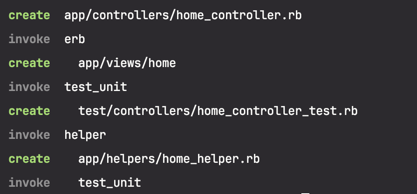
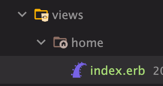

# Demo Project for Ruby on Rails
간단하게 `Ruby`와 Ruby 언어 기반 Web Application Framework `Rails`를 학습하기 위해 진행하는 데모 프로젝트입니다. 

### About MVC Pattern
- Controller : Model & View 연결 매개체
- Model : 어플리케이션 정보/데이터를 다루는 규칙
- View : 데이터 표현과 관련된 Ruby 코드가 삽입되어 있는 HTML 파일

```text
+--------+                                 +------------+      
|        |=========(Request)==============>|  route.rb  |
|        |                                 +------------+                    
| Client |                                      ⬇
|        |                +----------+     +------------+            +------------+       |----------| 
|        |<==(Response)===|   View   |  ◀  | Controller | ◀ (Data) ▶ |    Model   | >===< | Database |
+--------+                +----------+     +------------+            +------------+       |----------|

```

---

## Information
본 데모 프로젝트에 대한 정보입니다.

### Spec
- Ruby Version : ruby 3.2.2
- Rails Version :
- Configuration
- Database
  - creation
  - initialization
- Deployment instructions
- Services (job queues, cache servers, search engines, etc.)

<br/>

### Dependencies


<br/>

### Feature

<br/>

### Run & Test

<br/>

### Development
> - `routes.rb` : `./config` 패키지
> - View : `./app/views/{controller name}` 패키지 

1. Controller 생성
   - `./app/controllers` 패키지에 Controller Ruby 파일이 생성됩니다.
```shell
rails generate controller ${NAME}
```


2. Controller Ruby 파일에 Action 정의
```ruby
class HomeController < ApplicationController
  # "Index" Action
  def index
    # ...
  end
end
```

3. `routes.rb` 파일 내 Controller Action과 Request Mapping
```ruby
Rails.application.routes.draw do
  # ...
  
  # 기본 "/" path에 대한 설정이 없으면 Rails 기본 화면이 노출된다.
  get "/index" => "home#index", as: :home
  
  # ...
end
```

4. View 구현
   - Action 이름에 맞추어 파일을 생성해야 합니다.
> `erb` : **E**mbedded **R**u**B**y
```ruby
# index.erb
hello world!
```
